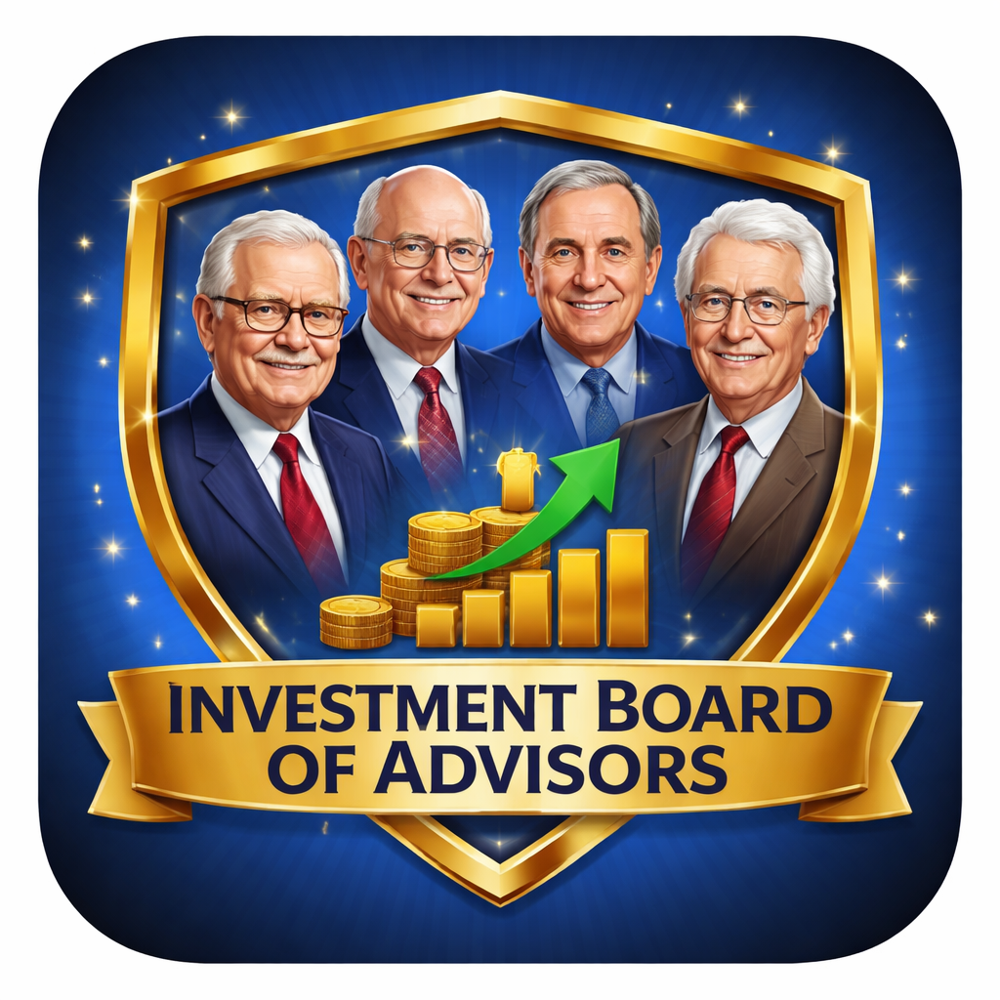

# 💰 Investment Board of Advisors

Get personalized investment wisdom from AI versions of the world's greatest investors.



## 🌟 Your Advisors

| Advisor | Expertise |
|---------|-----------|
| 📈 **Warren Buffett** | Value Investing & Business Analysis |
| 🧪 **Peter Lynch** | Growth Investing & Research |
| 🌊 **Ray Dalio** | Macro Economics & Principles |
| 📊 **John Bogle** | Index Investing & Low-Cost Strategy |
| 📚 **Benjamin Graham** | Father of Value Investing & Margin of Safety |
| 🌍 **George Soros** | Macro Trading & Reflexivity |
| 📝 **Howard Marks** | Risk Assessment & Market Cycles |
| ⚔️ **Carl Icahn** | Activist Investing & Corporate Governance |
| 🚀 **Cathie Wood** | Disruptive Innovation & Growth |

## 🚀 Quick Start (3 Steps!)

### 1. Get an API Key (Free to start!)
Go to [console.anthropic.com](https://console.anthropic.com) and create an API key.

### 2. Clone & Setup
```bash
git clone https://github.com/YOUR_USERNAME/investment-board-of-advisors.git
cd investment-board-of-advisors
./setup.sh
```

### 3. Launch!
Double-click the app that appears on your Desktop!

## 💡 Features

- **Single Advisor Mode** - Get focused advice from one investment legend
- **Board Meeting Mode** - All advisors weigh in on your investment question
- **Synthesis** - AI combines all perspectives into actionable recommendations
- **Custom Desktop App** - One-click launch with your name on it

## 📖 Usage Examples

```bash
# Interactive mode (recommended)
python3 main.py

# Quick question to one advisor
python3 main.py --advisor warren_buffett -q "Should I invest in index funds or individual stocks?"

# Full board meeting with synthesis
python3 main.py --board-meeting -q "Is now a good time to invest in tech stocks?" --synthesize

# Select specific advisors
python3 main.py --advisors warren_buffett,peter_lynch -q "How do I analyze a growth company?"
```

## 🔧 Customization

Want different advisors? Edit the files in the `personas/` folder!

Each persona file contains:
- Background & expertise
- Investment philosophy
- Key frameworks & principles
- How they analyze investments

## 📋 Requirements

- Python 3.8+
- Anthropic API key ([get one here](https://console.anthropic.com))

## ⚠️ Disclaimer

This is an educational tool for entertainment purposes. These AI advisors are inspired by real investors but are not affiliated with them. This is NOT financial advice. Always do your own research and consult with licensed financial professionals before making investment decisions.

## 🙏 Credits

Built with [Claude](https://anthropic.com) by Anthropic.

Inspired by the investment wisdom of Warren Buffett, Peter Lynch, Ray Dalio, John Bogle, Benjamin Graham, George Soros, Howard Marks, Carl Icahn, and Cathie Wood.

## 📄 License

MIT License - Use freely, share widely!
